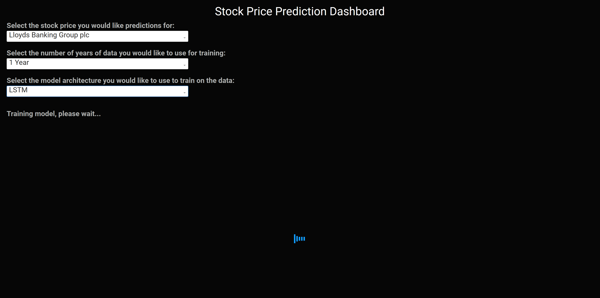
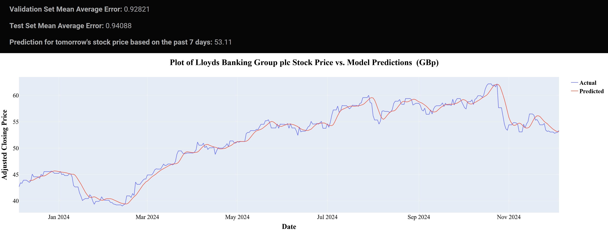

# Stock Price Prediction App

The following is a stock price prediction app built with Plotly Dash and Tensorflow. The app uses stocks taken from the Yahoo Finance <a href=https://uk.finance.yahoo.com/trending-tickers>trending tickers</a> page, and after training a model, it returns the model performance and a prediction for tomorrow's price given the last 7 days.
The user can choose what stock they would like to see, what model they would like to train, and how many years of financial data they would like to train on.




To run the app:

### Windows
```powershell
git clone https://github.com/liam-stuart/stock-prediction-app.git
cd ./stock-prediction-app/
python -m venv stock_app_venv
stock_app_venv/Scripts/activate
pip install -r requirements.txt
python data_collection.py
python stock_prediction_app.py
```

### Linux
```bash
git clone https://github.com/liam-stuart/stock-prediction-app.git
cd stock-prediction-app
python3 -m venv stock_app_venv
source stock_app_venv/bin/activate
pip install -r requirements.txt
python3 data_collection.py
python3 stock_prediction_app.py
```

After this, click on the provided location in the terminal to access the app.
