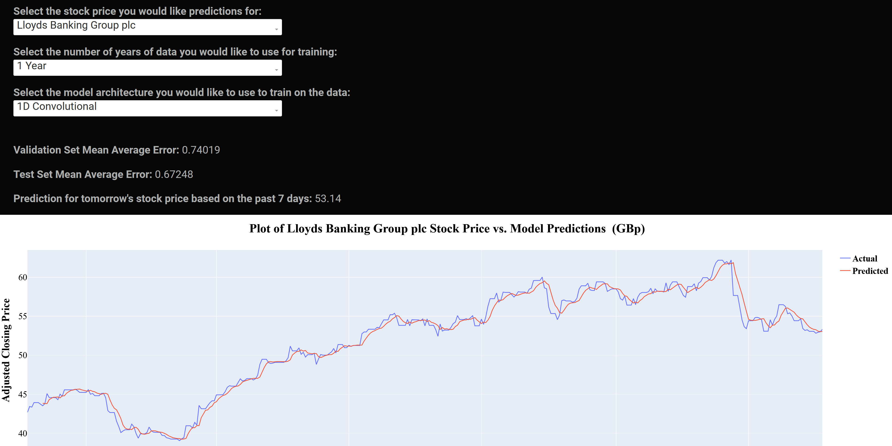

# Stock Price Prediction App

The following is a stock price prediction app built with Plotly Dash and Tensorflow. The app takes data from the Yahoo Finance <a href=https://uk.finance.yahoo.com/trending-tickers>trending tickers</a> page, and after training a model, returns the model performance and a prediction for tomorrow's price given the last 7 days.
The user can choose what stock they would like to see, what model they would like to train, and how many years of financial data they would like to train on.

